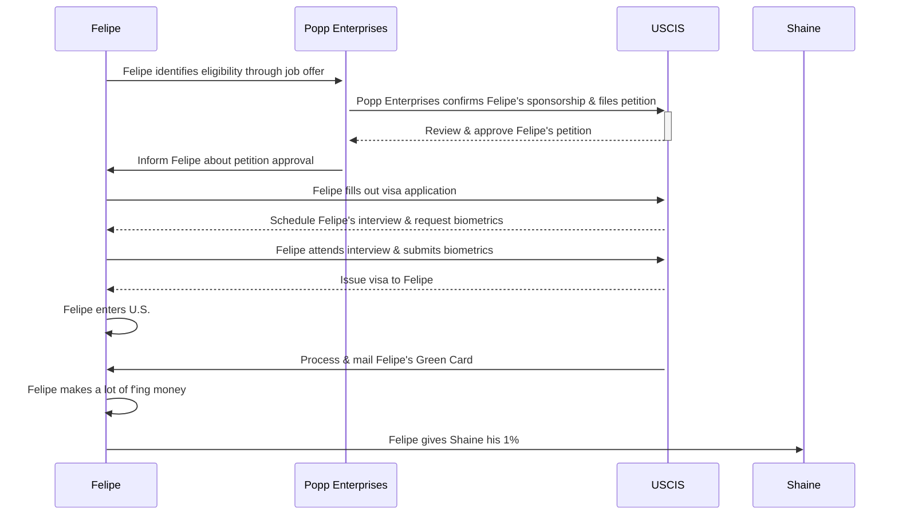

```mermaid
sequenceDiagram
    participant A as Felipe
    participant PE as Popp Enterprises
    participant USCIS
    participant S as Shaine
    A->>+PE: Felipe identifies eligibility through job offer
    PE->>+USCIS: Popp Enterprises confirms Felipe's sponsorship & files petition
    USCIS-->>-PE: Review & approve Felipe's petition
    PE->>A: Inform Felipe about petition approval
    A->>+USCIS: Felipe fills out visa application
    USCIS-->>A: Schedule Felipe's interview & request biometrics
    A->>USCIS: Felipe attends interview & submits biometrics
    USCIS-->>A: Issue visa to Felipe
    A->>A: Felipe enters U.S.
    USCIS->>A: Process & mail Felipe's Green Card
    A->>A: Felipe makes a lot of f'ing money
    A->>S: Felipe gives Shaine his 1%
```
